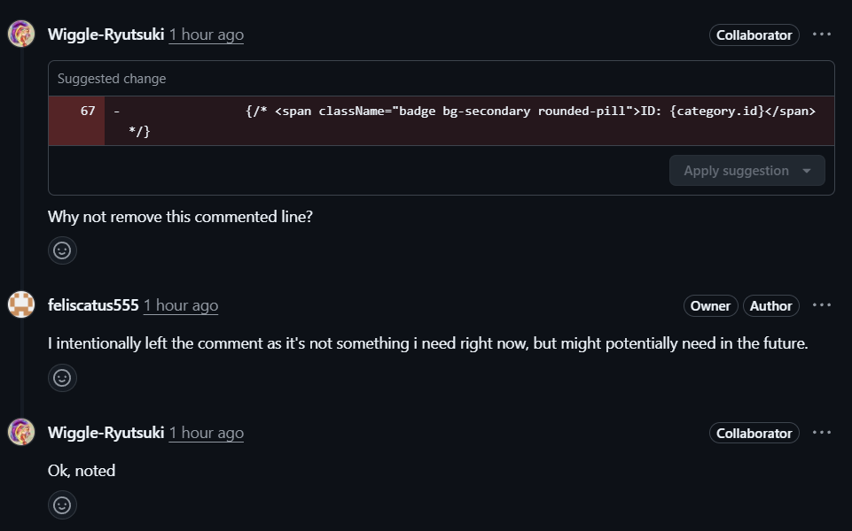

# Lab 1 — Peer Review Record  (fill this in)

**Author:** Maimoona Aziz — 67070503473 — GitHub: @Wiggle-Ryutsuki  
**Peer reviewer:** Iris French — 67070503478 — GitHub: @feliscatus555

## Pull Requests I authored (reviewed by my partner)
| PR | Branch | Reviewer verdict |
|----|--------|------------------|
| Foundation features #5 | feature/1-project-foundation | Foundation is sound. |
| Implemented API health check #6 | feature/2-health-check | The appropriate code has been made for issue 2, well done. |
| Created and seeded Prisma IT request categories #7 | feature/3-category-seed | Addresses everything correctly for issue 3, good job. |
|  Feature/4 category list- #8  | feature/4-category-list | Everything looks good, no errors spotted. |

**Reviewer comment I received:** Most of the comments I received from my reviewer were approvals and there were no major issues.    
**How I responded:** I acknowledged the approvals and carried on to the next task.

## Pull Requests I reviewed for my partner
**My comment:** There was one commented line where I thought might be better deleted, so I questioned this choice while suggesting to remove it. Other than that, the rest of the checks were fine and approved. 

**Partner's response:** They replied that the feature might be needed later and decided to keep it commented away. I accepted this response. Other than that, they acknowledged my approvals for the rest of the reviews and carried on.

 
