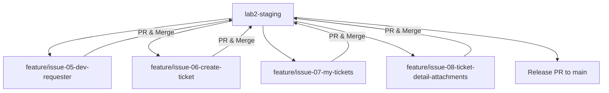

# Lab 2 Sprint Engineering Specification

**Document ID**: SPEC-LAB-02  
**Version**: 1.0  
**Status**: Draft / Pending Implementation  
**Method**: Spec-Driven Development (SDD)  
**Parent Specification**: `TokTickIT-System-Level-SDS-v1.0.pdf` (SDS-SYS-001)  
**Handout Reference**: `Lab_02_labsheet.pdf` (Lab 2 Requester Ticketing MVP with UI Foundation)  

---

## 1. Sprint Goal

Deliver a responsive, professional, end-to-end Requester-facing IT support ticketing MVP that enables an end-user (simulated via a temporary Development Requester identity) to select their requester profile, submit new IT support tickets with optional attachments, view and filter their own ticket history in a paginated list, inspect ticket details, and manage attachments with compliant soft-removal rules under the Zen Green UI design system.

---

## 2. Stakeholder Request Interpretation

The IT department requires an initial operational increment allowing campus requesters to log support requests across defined service categories and related systems. For this sprint:
* The user experience focuses strictly on the **Requester role**.
* To simulate multi-user data isolation before full authentication is implemented in Lab 3, a **Development Requester Selector** is provided to switch between seeded active requesters.
* Requesters can create tickets with structured metadata (category, related system, requested priority, summary, description) and up to 5 attachments (max 5 MB each, JPG/PNG/WEBP/PDF).
* Requesters can view only their own tickets in **My Tickets**, with full support for search, filtering, sorting, and pagination.
* Requesters can open an owned ticket in **Ticket Detail**, inspect read-only properties, add additional attachments, download active attachments, and perform soft-removal of attachments with a mandatory confirmation and removal reason.
* The frontend must adhere to the **Zen Green Theme** and establish reusable UI components (forms, buttons, badges, tables, alerts, dialogs).

---

## 3. Scope

### 3.1. Included Scope (Feature-5 through Feature-8)
1. **Feature-5: Development Requester Context & Selection** (`Lab_02_labsheet.pdf`, Section 1, 3, 4.1, 8.1; System SDS D-04/D-05 notes)
   * Seeded active and inactive requesters in PostgreSQL.
   * Development Requester Selector UI to switch current requester context.
   * Persistent client-side selection context and shell display.
   * Context-aware API requests scoped by selected requester ID.
2. **Feature-6: Ticket Creation (Create Mode)** (`Lab_02_labsheet.pdf`, Section 1, 3, 4.4, 8.2, 8.3; System SDS D-02, D-03, D-10)
   * Create Ticket form with fields: Ticket Number (system generated / read-only), Ticket Date (read-only), Requester (read-only / auto-populated), Category (dropdown), Related System (dropdown), Requested Priority (dropdown), Summary (text input), Description (textarea), Attachments (file input).
   * Backend transactional Ticket Number generation (`TKT-YYYY-NNNNN`).
   * Initial ticket status set to `New`.
   * Field-level validation, busy submission states, and failure recovery.
3. **Feature-7: My Tickets (List Mode, Search, Filter, Sort, Pagination)** (`Lab_02_labsheet.pdf`, Section 1, 3, 6.1, 8.4; System SDS D-02, D-03)
   * Server-side filtered and paginated list of tickets owned by the current requester.
   * Search across Ticket Number and Summary.
   * Filtering by Category, Requested Priority, and Status.
   * Sorting by Ticket Date/Number and Last Updated.
   * Empty states, no-results states, loading states, and error handling.
   * Immediate list update when switching Development Requester context.
4. **Feature-8: Requester Ticket Detail (View Mode) & Attachment Lifecycle** (`Lab_02_labsheet.pdf`, Section 1, 3, 4.5, 8.5; System SDS D-06, D-11)
   * Read-only presentation of ticket details and metadata.
   * Backend ownership enforcement preventing cross-requester access.
   * Adding new attachments to an existing open ticket.
   * Secure download of active attachments.
   * Soft-removal of attachments with modal confirmation and required reason.
   * Display of soft-removed attachments as non-downloadable tombstones.

### 3.2. Excluded Scope (Deferred to Lab 3 / Lab 4 / Later Phases)
* **Authentication & Security** (`Lab_02_labsheet.pdf`, Section 4.2, p. 4): Real login/logout, password hashing (Argon2id), session management cookies, JWT/opaque tokens, real RBAC enforcement.
* **IT Staff Workflows** (`Lab_02_labsheet.pdf`, Section 4.2, p. 4): IT Staff queue, ticket assignment/claiming, IT Priority updates, status changes beyond `New` (e.g., In Progress, Pending Requester, Resolved, Closed, Cancelled).
* **Collaboration Features** (`Lab_02_labsheet.pdf`, Section 4.2, p. 4): Public Comments, Internal Notes, Actions Taken (Service Actions), and Event Log rendering.
* **Administration & System Settings** (`Lab_02_labsheet.pdf`, Section 4.2, p. 4): User management CRUD, category management CRUD, system-wide configuration.
* **External Integrations** (`TokTickIT-System-Level-SDS-v1.0.pdf`, Section *System Scope*, p. 3–4): Email notifications, cloud S3 storage, external SSO, CMDB/asset management.

---

## 4. Functional Requirements (FR)

| FR ID | Feature Area | Description | Citation |
| :--- | :--- | :--- | :--- |
| **FR-01** | Feature-5 (Dev Requester) | The system shall retrieve all active Development Requesters from the database and populate the selection dropdown. Inactive requesters must be excluded. | `Lab_02_labsheet.pdf`, Section 5.3, 8.1 |
| **FR-02** | Feature-5 (Dev Requester) | The user interface shall allow switching the current Development Requester context at any time via a "Change Requester" action in the header, reloading all ticket data for the newly selected requester. | `Lab_02_labsheet.pdf`, Section 8.1 |
| **FR-03** | Feature-6 (Create Ticket) | The system shall display the Create Ticket form with reference data (Categories, Related Systems, Priorities) loaded dynamically from the backend. | `Lab_02_labsheet.pdf`, Section 4.4, 5.3 |
| **FR-04** | Feature-6 (Create Ticket) | The system shall auto-populate the Requester field with the currently selected Development Requester name/email and mark it read-only. | `Lab_02_labsheet.pdf`, Section 4.4, 8.2 |
| **FR-05** | Feature-6 (Create Ticket) | The system shall validate all required fields (Summary, Category, Related System, Requested Priority, Description) on both client and server before accepting ticket creation. | `Lab_02_labsheet.pdf`, Section 4.4, 8.3 |
| **FR-06** | Feature-6 (Create Ticket) | Upon valid submission, the backend shall create the ticket record with status `New`, assign the next annual sequence number (`TKT-YYYY-NNNNN`), link any valid uploaded attachments, and return HTTP 201 with the created ticket DTO. | `Lab_02_labsheet.pdf`, Section 4.3 (BR-01, BR-02), 6.4; System SDS D-10 |
| **FR-07** | Feature-6 (Create Ticket) | The UI shall display a clear success confirmation banner containing the newly generated Ticket Number and provide navigation back to My Tickets or to view the created ticket. | `Lab_02_labsheet.pdf`, Section 8.3 |
| **FR-08** | Feature-7 (My Tickets) | The system shall fetch and display a paginated list of tickets owned strictly by the currently selected Requester. | `Lab_02_labsheet.pdf`, Section 1, 6.1, 8.4 |
| **FR-09** | Feature-7 (My Tickets) | The system shall support live search filtering on Ticket Number and Summary, and dropdown filtering by Category, Requested Priority, and Status. | `Lab_02_labsheet.pdf`, Section 6.1, 8.4 |
| **FR-10** | Feature-7 (My Tickets) | The system shall support column sorting by Ticket Date, Ticket Number, and Last Updated (ascending/descending) with pagination controls (page size, previous/next, page index). | `Lab_02_labsheet.pdf`, Section 6.1, 8.4 |
| **FR-11** | Feature-7 (My Tickets) | The UI shall render distinct representations for empty ticket state (requester has 0 tickets) and no-results search state (filter matched 0 tickets). | `Lab_02_labsheet.pdf`, Section 8.4 |
| **FR-12** | Feature-8 (Ticket Detail) | The system shall render the Ticket Detail view showing all ticket attributes (Ticket No, Date, Status, Requester, Category, Related System, Priorities, Summary, Description) as read-only. | `Lab_02_labsheet.pdf`, Section 8.5 |
| **FR-13** | Feature-8 (Ticket Detail) | The backend shall enforce ownership validation on ticket detail access and return HTTP 403 / 404 if a requester attempts to access a ticket owned by another user. | `Lab_02_labsheet.pdf`, Section 3, 6.3, 14 (Part 8); System SDS p. 10 |
| **FR-14** | Feature-8 (Attachments) | The system shall allow uploading permitted attachments (JPG, PNG, WEBP, PDF up to 5 MB per file, max 5 active per ticket) on initial ticket creation or on the Ticket Detail screen. | `Lab_02_labsheet.pdf`, Section 4.5; System SDS p. 14 |
| **FR-15** | Feature-8 (Attachments) | The system shall allow the requester to soft-remove their own attachment, requiring a confirmed removal reason, setting `deletedAt` and `deletedById`, and rendering a non-downloadable tombstone in the UI. | `Lab_02_labsheet.pdf`, Section 4.5; System SDS p. 14 |
| **FR-16** | Feature-8 (Attachments) | The backend shall provide an authenticated/scoped download endpoint that streams active attachment binaries and rejects download requests for soft-removed attachments. | `Lab_02_labsheet.pdf`, Section 4.5, 6; System SDS p. 14 |

---

## 5. Business Rules (BR)

| BR ID | Rule Name | Specification Details | Source Citation |
| :--- | :--- | :--- | :--- |
| **BR-01** | Ticket Number Format | The official Ticket Number is generated by the backend, unique, immutable, and formatted as `TKT-YYYY-NNNNN` (with 5-digit zero-padded annual sequence reset). | `Lab_02_labsheet.pdf`, Section 4.3; System SDS D-10 |
| **BR-02** | Initial Ticket Status | Every newly created Ticket begins with Current Status `New`. | `Lab_02_labsheet.pdf`, Section 4.3; System SDS D-02 |
| **BR-03** | Simulated Auth Boundary | Lab 2 uses a Development Requester selector instead of login. The selected identity is for testing only and is not secure authentication. Inactive requesters must not be selectable. | `Lab_02_labsheet.pdf`, Section 4.3, 5.3 |
| **BR-04** | Requester Data Isolation | A Requester may view and access only tickets that belong to their own `requesterId`. Direct requests (via UI or API) for tickets or attachments belonging to another requester must be rejected. | `Lab_02_labsheet.pdf`, Section 3, 6.3, 14 (Part 7 & 8) |
| **BR-05** | Ticket Summary Constraints | Summary is required, single-line text, trimmed of leading/trailing whitespace, minimum 5 characters, maximum 120 characters. | `Lab_02_labsheet.pdf`, Section 4.4; System SDS p. 7 |
| **BR-06** | Ticket Description Constraints | Description is required, multiline text, trimmed, minimum 10 characters, maximum 2000 characters. | `Lab_02_labsheet.pdf`, Section 4.4; System SDS p. 7 |
| **BR-07** | Priority Vocabulary | Requested Priority must be one of: `Low`, `Medium`, `High`, `Urgent`. Default value is `Medium`. In Lab 2, `itPriority` is initialized to match `requestedPriority`. | `TokTickIT-System-Level-SDS-v1.0.pdf`, D-03, p. 12; `Lab_02_labsheet.pdf`, Section 4.4 |
| **BR-08** | Attachment Constraints | Allowed file extensions: `.jpg`, `.jpeg`, `.png`, `.webp`, `.pdf`. Allowed MIME types: `image/jpeg`, `image/png`, `image/webp`, `application/pdf`. Maximum file size: 5,242,880 bytes (5 MB). Maximum active attachments per ticket: 5. | `Lab_02_labsheet.pdf`, Section 4.5; System SDS p. 14 |
| **BR-09** | Soft-Removal Policy | Attachments are never hard-deleted from database metadata. Soft-removal sets `deletedAt = now()` and records `deletedById` plus `removalReason`. Soft-removed attachments cannot be downloaded, previewed, or counted toward the active 5-file limit. | `Lab_02_labsheet.pdf`, Section 4.5; System SDS D-11, p. 14 |
| **BR-10** | Attachment Removal Authorization | Only the uploader (current requester) may soft-remove their attachment while the ticket is in an active non-Closed state. A non-empty removal reason is mandatory. | `Lab_02_labsheet.pdf`, Section 4.5; System SDS p. 14 |
| **BR-11** | Reference Data Invariants | Tickets must reference an active `Category` and an active `RelatedSystem`. If reference data becomes inactive, historical tickets retain the relation, but new tickets cannot select inactive items. | `TokTickIT-System-Level-SDS-v1.0.pdf`, Section *Domain Data Model*, p. 7; `Lab_02_labsheet.pdf`, Section 5.3 |
| **BR-12** | Form Error Resilience | In the event of an API error or validation rejection, the frontend form state and all user-entered field values must be fully preserved without data loss. | `Lab_02_labsheet.pdf`, Section 4.4, 8.6, 14 (Part 6); System SDS p. 13 |

---

## 6. UI Specification Summary

* **Design System**: Strict conformance to the **Zen Green Theme** specified in `Lab_02_labsheet.pdf` (Section 7, p. 8):
  * Primary Green (`#006B3C`), Secondary Green (`#0B7A46`), Pale Green (`#EAF6EF`), Background (`#F5F7F6`).
* **Shell & Navigation**:
  * Top navigation bar containing TokTickIT brand logo/title, navigation links (*My Tickets*, *Create Ticket*), and the active Development Requester badge with a prominent *Change Requester* button.
* **Component Styling & Feedback**:
  * Standardized input heights, red asterisks on required field labels, field-level validation messages rendered directly below controls.
  * Buttons with visible text and clear visual hierarchy (Primary, Secondary, Destructive, Disabled, Busy spinner).
  * Status and Priority badges using readable text and distinct background colors (never communicating status by color alone).
* **Detailed Screen Specifications**: Fully documented in [`docs/lab-02/ui-spec.md`](file:///c:/Users/Maimoona%20Aziz/OneDrive/Desktop/toktickit/docs/lab-02/ui-spec.md).

---

## 7. Data Changes and Database Increment

### 7.1. Prisma Schema Design
The PostgreSQL schema expands from the Lab 1 single `Category` model to support full Requester ticketing concepts:

```prisma
datasource db {
  provider = "postgresql"
  url      = env("DATABASE_URL")
}

generator client {
  provider = "prisma-client-js"
}

enum Role {
  REQUESTER
  IT_STAFF
  ADMINISTRATOR
}

enum TicketStatus {
  NEW
  ASSIGNED
  IN_PROGRESS
  PENDING_REQUESTER
  RESOLVED
  CLOSED
  CANCELLED
}

enum Priority {
  LOW
  MEDIUM
  HIGH
  URGENT
}

model User {
  id          Int          @id @default(autoincrement())
  email       String       @unique
  displayName String
  role        Role         @default(REQUESTER)
  isActive    Boolean      @default(true)
  createdAt   DateTime     @default(now())
  updatedAt   DateTime     @updatedAt

  requestedTickets Ticket[]     @relation("RequesterTickets")
  attachments      Attachment[] @relation("UploadedAttachments")

  @@map("users")
}

model Category {
  id          Int          @id @default(autoincrement())
  name        String       @unique
  code        String?      @unique
  description String?
  isActive    Boolean      @default(true)
  createdAt   DateTime     @default(now())

  tickets     Ticket[]

  @@map("categories")
}

model RelatedSystem {
  id          Int          @id @default(autoincrement())
  name        String       @unique
  description String?
  isActive    Boolean      @default(true)
  createdAt   DateTime     @default(now())

  tickets     Ticket[]

  @@map("related_systems")
}

model Ticket {
  id                Int          @id @default(autoincrement())
  ticketNo          String       @unique
  title             String       // Summary
  description       String
  requesterId       Int
  categoryId        Int
  relatedSystemId   Int
  requestedPriority Priority     @default(MEDIUM)
  itPriority        Priority     @default(MEDIUM)
  status            TicketStatus @default(NEW)
  version           Int          @default(1)
  createdAt         DateTime     @default(now())
  updatedAt         DateTime     @updatedAt

  requester         User         @relation("RequesterTickets", fields: [requesterId], references: [id])
  category          Category     @relation(fields: [categoryId], references: [id])
  relatedSystem     RelatedSystem @relation(fields: [relatedSystemId], references: [id])
  attachments       Attachment[]

  @@index([requesterId])
  @@index([status])
  @@index([categoryId])
  @@index([createdAt])
  @@map("tickets")
}

model Attachment {
  id               Int       @id @default(autoincrement())
  ticketId         Int
  uploadedById     Int
  originalFilename String
  storedFilename   String
  mimeType         String
  sizeBytes        Int
  storagePath      String
  deletedAt        DateTime?
  deletedById      Int?
  removalReason    String?
  createdAt        DateTime  @default(now())

  ticket           Ticket    @relation(fields: [ticketId], references: [id], onDelete: Cascade)
  uploadedBy       User      @relation("UploadedAttachments", fields: [uploadedById], references: [id])

  @@index([ticketId])
  @@index([deletedAt])
  @@map("attachments")
}

model TicketSequence {
  year      Int @id
  lastValue Int @default(0)

  @@map("ticket_sequences")
}
```

### 7.2. Seed Data Requirements (`Lab_02_labsheet.pdf`, Section 5.3)
1. **Categories (4 required)**:
   * Account and Access, Hardware, Software, Network.
2. **Related Systems (6+ required)**:
   * Email, Campus Wi-Fi, VPN, LEB2 App, Grade Submission App, Printer, Corporate Laptop.
3. **Development Requesters**:
   * Active (&ge;4):
     * Jennifer Anderson (`jennifer.anderson@kmutt.ac.th`)
     * Sarah Johnson (`sarah.johnson@kmutt.ac.th`)
     * David Lee (`david.lee@kmutt.ac.th`)
     * Michael Brown (`michael.brown@kmutt.ac.th`)
   * Inactive (&ge;1):
     * Alex Taylor (`alex.taylor.inactive@kmutt.ac.th`, `isActive: false`)

---

## 8. API Contract Summary

Endpoints are exposed under `/api` (and aliased to `/api/v1` for future compatibility). Detailed request/response payloads, query schemas, and status codes are provided in [`docs/lab-02/api-spec.md`](file:///c:/Users/Maimoona%20Aziz/OneDrive/Desktop/toktickit/docs/lab-02/api-spec.md).

| Method | Endpoint | Purpose | Status Codes |
| :--- | :--- | :--- | :--- |
| `GET` | `/api/requesters` | Fetch list of active Development Requesters | 200, 500 |
| `GET` | `/api/categories` | Fetch active categories | 200, 500 |
| `GET` | `/api/related-systems` | Fetch active related systems | 200, 500 |
| `POST` | `/api/tickets` | Create a new ticket with optional attachments | 201, 400, 422, 500 |
| `GET` | `/api/tickets` | Get paginated tickets for selected requester | 200, 400, 500 |
| `GET` | `/api/tickets/:id` | Get single ticket details with attachments | 200, 403, 404, 500 |
| `POST` | `/api/tickets/:id/attachments` | Upload an attachment to an existing ticket | 201, 400, 403, 404, 422, 500 |
| `GET` | `/api/tickets/:id/attachments/:attachmentId` | Download active attachment file binary | 200, 403, 404, 410, 500 |
| `DELETE` | `/api/tickets/:id/attachments/:attachmentId` | Soft-remove attachment with reason | 200, 400, 403, 404, 422, 500 |

---

## 9. Acceptance Criteria (Given-When-Then)

* **AC-01 (Ticket Creation Happy Path)**:  
  *Given* an active Development Requester is selected,  
  *When* valid ticket data (Summary, Category, Related System, Priority, Description) is submitted,  
  *Then* one ticket is saved in PostgreSQL with status `NEW`, an official Ticket Number formatted as `TKT-YYYY-NNNNN` is generated, and the success screen displays the number.
* **AC-02 (Requester Selection Gate)**:  
  *Given* no Development Requester is selected in local state,  
  *When* the user accesses the application,  
  *Then* the Development Requester Selection screen is displayed and ticket actions are blocked until a selection is confirmed.
* **AC-03 (Cross-Requester Ticket List Isolation)**:  
  *Given* Requester A has 3 tickets and Requester B has 2 tickets,  
  *When* Requester A is selected in the shell,  
  *Then* only Requester A's 3 tickets are displayed in My Tickets, and none of Requester B's tickets appear.
* **AC-04 (Cross-Requester Detail Access Forbidden)**:  
  *Given* Ticket X belongs to Requester A,  
  *When* Requester B attempts to retrieve or view Ticket X by ID,  
  *Then* the API returns HTTP 403 / 404 and the UI displays an unauthorized/not found error message.
* **AC-05 (Create Ticket Validation Failure)**:  
  *Given* the Create Ticket form is submitted with an empty Summary or Description shorter than 10 characters,  
  *When* the user clicks Submit,  
  *Then* the API is not called, field-level validation errors appear directly beneath invalid controls, and form contents are preserved.
* **AC-06 (Attachment File Size & Type Validation)**:  
  *Given* the user attempts to upload a `.exe` file or a file larger than 5 MB,  
  *When* the file is selected or submitted,  
  *Then* the upload is rejected with a clear validation message and not stored on the server.
* **AC-07 (Attachment Max Limit Enforcement)**:  
  *Given* a ticket already has 5 active attachments,  
  *When* the user attempts to upload a 6th attachment,  
  *Then* the system rejects the operation and indicates that the maximum of 5 active attachments has been reached.
* **AC-08 (Attachment Soft-Removal with Reason)**:  
  *Given* an active attachment on an owned ticket,  
  *When* the requester clicks remove, confirms the prompt, and provides a valid removal reason,  
  *Then* the attachment `deletedAt` timestamp and reason are recorded, the UI displays a soft-removed tombstone, and subsequent download attempts return HTTP 410 / 404.
* **AC-09 (Search and Filtering in My Tickets)**:  
  *Given* the My Tickets view with multiple tickets,  
  *When* the requester enters search text or selects a Category/Status filter,  
  *Then* the list dynamically updates to show only matching tickets with correct pagination counts.
* **AC-10 (No-Results vs Empty List State)**:  
  *Given* a search query that matches zero tickets,  
  *When* the results are rendered,  
  *Then* the UI displays a clear "No matching tickets found" message with a "Clear Filters" button rather than a generic empty inbox state.

---

## 10. Definition of Done (DoD)

### 10.1. Product Completion Checklist
- [ ] All 4 feature increments (Feature-5 through Feature-8) implemented and compliant with specifications.
- [ ] Prisma schema migration and idempotent seed script (`prisma/seed.ts`) fully functional.
- [ ] All Acceptance Criteria (AC-01 through AC-10) verified with automated tests.
- [ ] Unit tests, API integration tests, and UI component tests passing with zero skips or failures.
- [ ] Responsive layout validated across Desktop (&ge;992px), Tablet (768–991px), and Mobile (<768px).
- [ ] Zen Green UI styles applied consistently across all screens, badges, and modals.
- [ ] Safe error handling and form state recovery verified during server failure.

### 10.2. Course Delivery Checklist
- [ ] GitHub Issues created for Issue 5 through Issue 8 with appropriate Kanban tags.
- [ ] Feature branches branched from `lab2-staging` and integrated via reviewed PRs.
- [ ] `reviewer.md` and `ai-use.md` maintained and completed.
- [ ] Visual inspection screenshots captured and stored in `artifacts/lab-02/screenshots/`.
- [ ] Final release PR merged from `lab2-staging` to `main`.

---

## 11. Work Breakdown, Dependencies, and Branch Flow



### Issue Decomposition & Merge Order:
1. **Issue 5: Development Requester Context & Reference Data**
   * *Branch*: `feature/5-dev-requester`
   * *Scope*: Prisma schema update (User, Category, RelatedSystem), seed data, requester selection API, Dev Requester UI selector, Context Provider.
2. **Issue 6: Create Ticket Screen & Submission API**
   * *Branch*: `feature/6-create-ticket`
   * *Scope*: Ticket & Sequence Prisma models, ticket creation API (`POST /api/tickets`), Zen Green Create Ticket UI, validation, success feedback.
3. **Issue 7: My Tickets List, Search, Filter & Pagination**
   * *Branch*: `feature/7-my-tickets`
   * *Scope*: Paginated ticket list API (`GET /api/tickets`), search/filter/sort queries, My Tickets table/cards UI, empty and no-results states.
4. **Issue 8: Requester Ticket Detail & Attachment Lifecycle**
   * *Branch*: `feature/8-ticket-detail-attachments`
   * *Scope*: Ticket detail API (`GET /api/tickets/:id`), Attachment model & upload/download/soft-delete endpoints, Ticket Detail view, Attachment section & soft-removal modal.

---

## 12. Assumptions, Missing Items, and Proposed Decisions

1. **Proposed Decision (Storage Adapter)**: For Lab 2 local development, attachments are stored on local filesystem disk (under `server/uploads/`) behind an abstraction service that matches S3/SeaweedFS API contracts, avoiding mandatory external daemon setup while keeping metadata in PostgreSQL.
2. **Proposed Decision (Identifier Strategy)**: In Prisma, primary keys use autoincrement integers for compatibility with Lab 1 baseline (`Category`), while external ticket identifiers strictly use the mandated business string format `TKT-YYYY-NNNNN`.
3. **Proposed Decision (Requester Selection Header)**: The Development Requester context is stored in `localStorage` and React Context for persistence across page reloads during evaluation.
